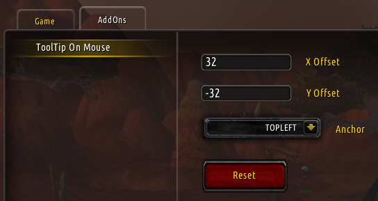

# TTOM: ToolTip On Mouse

World of Warcraft addon: Attach tooltip to mouse with anchor and offset.

- Open Settings->Addons->ToolTipOnMouse to change options.
  - Can also use `/ttom` or `/tooltiponmouse` to go directly to options.
- Adjust anchor and offset.
- Reset will restore default settings.
