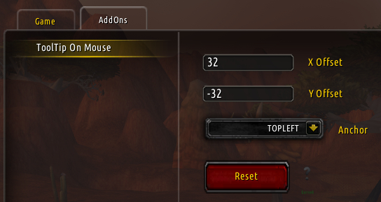

# 💬 TTOM

Attach tooltip to mouse, with anchor and offset.

## Usage

- Open **Options->AddOns->TTOM (ToolTip On Mouse)** to change options.
  - Can also use `/ttom` or `/tooltiponmouse` to go directly to options.
- Adjust anchor and offset.
- Reset will restore default options.

## Thanks

- <https://github.com/boktai1000/TooltipOnMouse>
- <https://github.com/ketho-wow/HelloWorld>
